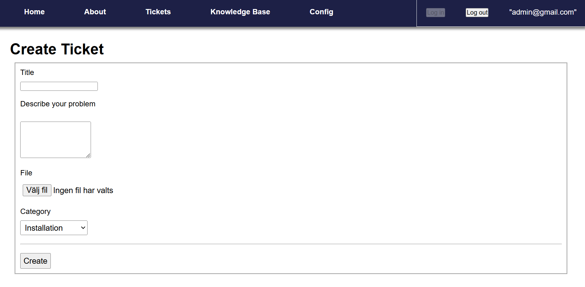

# Title

Ticket Client

## Introduction

This is a web client for creating support tickets. You will first need an account with auth0 to log in to. You can then create support tickets with this account with a title, description, category and file. As an agent, you can claim tickets and comment on them to communicate with the user. You can also read and create articles with the knowledge base.

## How to Use

If you are an agent, you first need to have an admin account. Create an account with auth0 under "User Management" named "admin@gmail.com" and loging in with it should give you admin permissions. Use auth0 to create new accounts. You can log in with admin@gmail.com to make users into agents in the config page.

### Prerequisites

Run command to install packages:
npm install

For the file attachment to work with bigger files you need to go into your my.ini and under [mysqld] type in "max_allowed_packet=1000M".

Set up a auth0 single page application. Get your domain and clientId, then paste them into the auth_config.json file.

In the settings of your auth0 app under: Allowed Callback URLs, Allowed Logout URLs and Allowed Web Origins you also need to fill in your hosting URL. For local hosting paste "http://localhost:3000" into every field.

Browsers like firefox and brave block third party cookies. In order for the authentication to work properly, you need to either change the settings to allow third party cookies or use a different browser like chrome or edge for instance.

### Build

Run the commands to create or recreate the database "tickets":
(in sql/tickets) mariadb --table < reset.sql

### Run

To run: (In root of project) npm run dev

To stop: CTRL+C

## License

MIT, CC